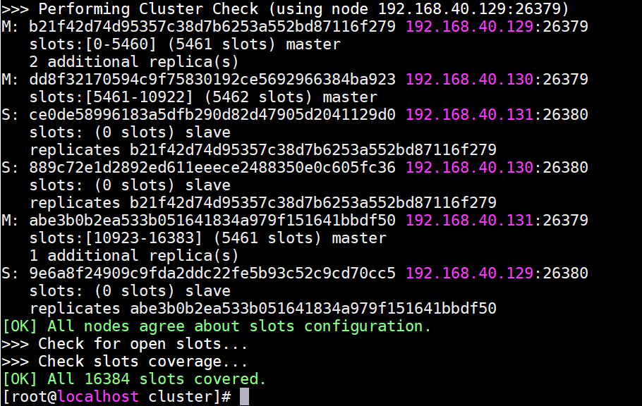

[](./LICENSE "LICENSE")  []( https://redis.io/ "software") [](https://github.com/weiliang-ms/nginx-rpm/releases/tag/latest "release")

# redis部署文档

**依赖说明：**

- yum源：安装gcc编译redis源代码（已安装gcc可不配置yum源）

- root权限：用以调整防火墙策略，配置redis为系统服务实现自启动

**redis版本说明：**

5.0.5

**生产环境推荐集群模式**

## 单点集成

> 1、yum可用性检测

判断是否含有gcc

```
rpm -qa|grep gcc|grep -v lib
```

如回显如下，直接跳过此步骤

```
gcc-4.8.5-28.el7_5.1.x86_64
```

尝试yum安装gcc

```
yum install -y gcc
echo $?
```

若返回值为0，证明安装完成，如非0说明yum有问题，需调整本机的yum配置

[yum配置方式参考](http://192.168.131.211:8888/press/deploy/linux/yum)

> 2、下载安装脚本及介质

**互联网环境下可通过东软vpn访问此地址**

[redis-deploy-latest.tar.gz下载地址](http://192.168.174.68:8888/download/deploy/soft/redis/redis-deploy-latest.tar.gz)

> 3、上传安装

上传redis-deploy-latest.tar.gz至/tmp下，root用户执行以下命令安装

```
cd /tmp && tar zxvf redis-deploy-latest.tar.gz && cd redis/simple && sh install.sh
```

- redis信息说明

   - redis配置文件
 
   ```
   /etc/redis-6379.conf
   ```
  
   -  redis端口号
   ```
   6379
  ```
  
- redis启停指令

    - 启动实例

    ```sh
    redis-server /etc/redis-6379.conf
    ```

    - 查看实例

	```sh
    ps -ef|grep redis
    curl 127.0.0.1:6379
    ```

    - 关闭实例

    ```sh
    redis-cli -a redis shutdown
    ```

    - 客户端连接

    ```sh
    redis-cli -p 6379 -a redis
    ```
    
## 集群模式

- 集群模式说明

    - 采用多节点分片模式，进行数据存储，不存在`db`概念，不同系统使用同一`redis cluster` 注意`key`不可重复，建议加前缀

    - 建议：三节点三主三从模式

    - 资源利用率：由于每个主节点存在一个副本集，内存资源使用率为：集群节点内存总和/副本集数

    - 安装流程示意如下（通过sshpass技术实现静默安装，自动安装初始化redis集群）

假设redis节点如下：

- 192.168.40.151

- 192.168.40.152

- 192.168.40.153

> yum可用性检测

判断是否含有gcc

```
rpm -qa|grep gcc|grep -v lib
```

如回显如下，直接跳过此步骤

```
gcc-4.8.5-28.el7_5.1.x86_64
```

尝试yum安装gcc

```
yum install -y gcc
echo $?
```

若返回值为0，证明安装完成，如非0说明yum有问题，需调整本机的yum配置

[yum配置方式参考](http://192.168.131.211:8888/press/deploy/linux/yum)

> 下载安装脚本及介质

**互联网环境下可通过东软vpn访问此地址**

[redis-deploy-latest.tar.gz下载地址](http://192.168.174.68:8888/download/deploy/soft/redis/redis-deploy-latest.tar.gz)

[版本信息](http://192.168.174.68:8888/download/deploy/soft/redis/CHANGES.LOG)

> 上传修改安装脚本

上传至集群中任意一节点的/tmp下，root用户执行以下命令安装

```sh
cd /tmp && tar zxvf redis-deploy-latest.tar.gz && cd redis/cluster
```
	
修改`install.sh`内容，修改为实际IP地址与root口令

	NODE1=192.168.40.151     #redis实际节点1IP地址
	NODE2=192.168.40.152     #redis实际节点2IP地址
	NODE3=192.168.40.153     #redis实际节点3IP地址
	NODE1_PASSWORD=123456    #节点1 root密码
	NODE2_PASSWORD=123456    #节点2 root密码
	NODE3_PASSWORD=123456    #节点3 root密码
	SSH_PORT=22              #三个节点ssh端口

运行安装脚本

```sh
sh install.sh
```

成功结果如下



查询集群状态

```sh
redis-cli -c -p 26379 -a redis cluster nodes
```


> 开放端口

**仅作说明，安装脚本已自动修改防火墙策略**

每个节点需要开放以下四个端口：

- 26379 (redis服务端与客户端通信端口)

- 26380 (redis服务端与客户端通信端口)

- 36379 (redis服务端间通信端口)

- 36380 (redis服务端间通信端口)

关闭redis

	redis-cli -p 26379 -a redis shutdown
	redis-cli -p 26380 -a redis shutdown

    
客户端连接（建议neusoft用户：neusoft/1234%^&*）

	redis-cli -p 26379 -c -a redis
	redis-cli -p 26379 -c -a redis
	
**配置样例**

	spring:
	  redis:
	    password: redis
	    cluster:
	      nodes:
	      - 192.168.40.151:26379
	      - 192.168.40.151:26380
	      - 192.168.40.152:26379
	      - 192.168.40.152:26380
	      - 192.168.40.153:26379
	      - 192.168.40.153:26380
	      max-redirects: 3

## k8s

创建service account

```sh
mkdir -p /k8s/redis
```

	cat > /k8s/redis/rbac.yaml <<EOF
	kind: ClusterRole
	apiVersion: rbac.authorization.k8s.io/v1
	metadata:
	  name: redis-provisioner-runner
	rules:
	- apiGroups: [""]
	  resources: ["persistentvolumes"]
	  verbs: ["get", "list", "watch", "create", "delete"]
	- apiGroups: [""]
	  resources: ["persistentvolumeclaims"]
	  verbs: ["get", "list", "watch", "update"]
	- apiGroups: [""]
	  resources: ["endpoints"]
	  verbs: ["get", "list", "watch", "create", "update", "patch"]
	- apiGroups: ["storage.k8s.io"]
	  resources: ["storageclasses"]
	  verbs: ["get", "list", "watch"]
	- apiGroups: [""]
	  resources: ["events"]
	  verbs: ["create", "update", "patch"]
	---
	kind: ClusterRoleBinding
	apiVersion: rbac.authorization.k8s.io/v1
	metadata:
	  name: redis-provisioner
	subjects:
	- kind: ServiceAccount
	  name: redis-provisioner
	  namespace: default
	roleRef:
	  kind: ClusterRole
	  name: redis-provisioner-runner
	  apiGroup: rbac.authorization.k8s.io
	---
	kind: Role
	apiVersion: rbac.authorization.k8s.io/v1
	metadata:
	  name: redis-provisioner
	rules:
	- apiGroups: [""]
	  resources: ["endpoints"]
	  verbs: ["get", "list", "watch", "create", "update", "patch"]
	---
	kind: RoleBinding
	apiVersion: rbac.authorization.k8s.io/v1
	metadata:
	  name: redis-provisioner
	subjects:
	- kind: ServiceAccount
	  name: redis-provisioner
	  # replace with namespace where provisioner is deployed
	  namespace: default
	roleRef:
	  kind: Role
	  name: redis-provisioner
	  apiGroup: rbac.authorization.k8s.io
	EOF 

创建

```sh
kubectl create -f /k8s/redis/rbac.yaml
```

k8s主节点创建NFS

	cat > /k8s/redis/nfs.yaml <<EOF
	apiVersion: v1
	kind: ServiceAccount
	metadata:
	  name: redis-provisioner
	---
	kind: Deployment
	apiVersion: extensions/v1beta1
	metadata:
	  name: redis-nfs-provisioner
	spec:
	  replicas: 1
	  strategy:
	    type: Recreate
	  template:
	    metadata:
	      labels:
	        app: redis-nfs-provisioner
	    spec:
	      imagePullSecrets:
	      - name: harborsecret
	      serviceAccount: redis-nfs-provisioner
	      containers:
	      - name: redis-nfs-provisioner
	        image: harbor.neusoft.com/external_storage/nfs-client-provisioner:latest
	        imagePullPolicy: IfNotPresent
	        volumeMounts:
	        - name: nfs-client-root
	          mountPath: /persistentvolumes
	        env:
	        - name: PROVISIONER_NAME
	          value: fuseim.pri/ifs
	        - name: NFS_SERVER
	          value: 192.168.174.68
	        - name: NFS_PATH
	          value: /data/nfs/redis
	      volumes:
	      - name: nfs-client-root
	        nfs:
	          server: 192.168.174.68
	          path: /data/nfs/redis
	EOF


创建

```sh
kubectl apply -f /k8s/redis/nfs.yaml
```

k8s主节点创建NFS StorageClass

	cat > /k8s/redis/class.yaml <<EOF
	apiVersion: storage.k8s.io/v1
	kind: StorageClass
	metadata:
	  name: redis-managed-nfs-storage
	provisioner: fuseim.pri/ifs
	parameters:
	  archiveOnDelete: "false"
	EOF

创建

	kubectl apply -f /k8s/redis/class.yaml

发布nacos

	cat > /k8s/redis/redis.yaml <<EOF
	---
	apiVersion: v1
	kind: Service
	metadata:
	  name: redis-headless
	  labels:
	    app: redis
	  annotations:
	    service.alpha.kubernetes.io/tolerate-unready-endpoints: "true"
	spec:
	  ports:
	    - port: 6379
	      name: server
	      targetPort: 6379
	  clusterIP: None
	  selector:
	    app: redis
	---
	apiVersion: v1
	kind: ConfigMap
	metadata:
	  name: nacos-cm
	data:
	  mysql.master.db.name: "nacos_devtest"
	  mysql.master.port: "3306"
	  mysql.slave.port: "3306"
	  mysql.master.user: "nacos"
	  mysql.master.password: "nacos"
	---
	apiVersion: apps/v1
	kind: StatefulSet
	metadata:
	  name: nacos
	spec:
	  serviceName: nacos-headless
	  replicas: 2
	  template:
	    metadata:
	      labels:
	        app: nacos
	      annotations:
	        pod.alpha.kubernetes.io/initialized: "true"
	    spec:
	      imagePullSecrets:
	      - name: harborsecret
	      affinity:
	        podAntiAffinity:
	          requiredDuringSchedulingIgnoredDuringExecution:
	            - labelSelector:
	                matchExpressions:
	                  - key: "app"
	                    operator: In
	                    values:
	                      - nacos
	              topologyKey: "kubernetes.io/hostname"
	      serviceAccountName: nfs-client-provisioner
	      initContainers:
	        - name: peer-finder-plugin-install
	          image: harbor.neusoft.com/nacos/nacos-peer-finder-plugin:latest
	          imagePullPolicy: Always
	          volumeMounts:
	            - mountPath: "/home/nacos/plugins/peer-finder"
	              name: plugindir
	      containers:
	        - name: nacos
	          imagePullPolicy: Always
	          image: harbor.neusoft.com/nacos/nacos-server:latest
	          resources:
	            requests:
	              memory: "2Gi"
	              cpu: "500m"
	          ports:
	            - containerPort: 8848
	              name: client-port
	          env:
	            - name: NACOS_REPLICAS
	              value: "3"
	            - name: SERVICE_NAME
	              value: "nacos-headless"
	            - name: POD_NAMESPACE
	              valueFrom:
	                fieldRef:
	                  apiVersion: v1
	                  fieldPath: metadata.namespace
	            - name: MYSQL_MASTER_SERVICE_DB_NAME
	              valueFrom:
	                configMapKeyRef:
	                  name: nacos-cm
	                  key: mysql.master.db.name
	            - name: MYSQL_MASTER_SERVICE_PORT
	              valueFrom:
	                configMapKeyRef:
	                  name: nacos-cm
	                  key: mysql.master.port
	            - name: MYSQL_SLAVE_SERVICE_PORT
	              valueFrom:
	                configMapKeyRef:
	                  name: nacos-cm
	                  key: mysql.slave.port
	            - name: MYSQL_MASTER_SERVICE_USER
	              valueFrom:
	                configMapKeyRef:
	                  name: nacos-cm
	                  key: mysql.master.user
	            - name: MYSQL_MASTER_SERVICE_PASSWORD
	              valueFrom:
	                configMapKeyRef:
	                  name: nacos-cm
	                  key: mysql.master.password
	            - name: NACOS_SERVER_PORT
	              value: "8848"
	            - name: PREFER_HOST_MODE
	              value: "hostname"
	          readinessProbe:
	            httpGet:
	              port: client-port
	              path: /nacos/v1/console/health/readiness
	            initialDelaySeconds: 60
	            timeoutSeconds: 3
	          livenessProbe:
	            httpGet:
	              port: client-port
	              path: /nacos/v1/console/health/liveness
	            initialDelaySeconds: 60
	            timeoutSeconds: 3
	          volumeMounts:
	            - name: plugindir
	              mountPath: /home/nacos/plugins/peer-finder
	            - name: datadir
	              mountPath: /home/nacos/data
	            - name: logdir
	              mountPath: /home/nacos/logs
	  volumeClaimTemplates:
	    - metadata:
	        name: plugindir
	        annotations:
	          volume.beta.kubernetes.io/storage-class: "managed-nfs-storage"
	      spec:
	        accessModes: [ "ReadWriteMany" ]
	        resources:
	          requests:
	            storage: 5Gi
	    - metadata:
	        name: datadir
	        annotations:
	          volume.beta.kubernetes.io/storage-class: "managed-nfs-storage"
	      spec:
	        accessModes: [ "ReadWriteMany" ]
	        resources:
	          requests:
	            storage: 5Gi
	    - metadata:
	        name: logdir
	        annotations:
	          volume.beta.kubernetes.io/storage-class: "managed-nfs-storage"
	      spec:
	        accessModes: [ "ReadWriteMany" ]
	        resources:
	          requests:
	            storage: 5Gi
	  selector:
	    matchLabels:
	      app: redis
	EOF

发布

```
kubectl apply -f /k8s/redis/redis.yaml
```